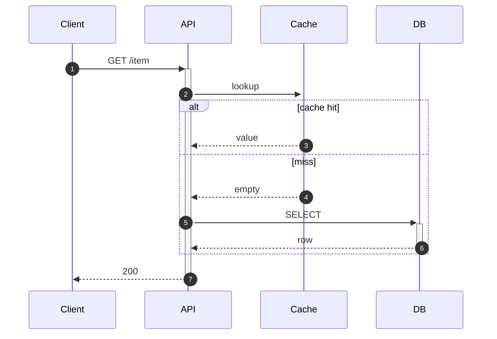

## TeX

```tex
\begin{aligned}
\int_{-\infty}^{\infty} e^{-x^2}\,dx &= \sqrt{\pi} \\
\sum_{n=1}^{\infty} \frac{1}{n^2} &= \frac{\pi^2}{6}
\end{aligned}
```

## Mermaid


```mermaid
sequenceDiagram
    autonumber
    participant C as Client
    participant A as API
    participant K as Cache
    participant D as DB

    C->>+A: GET /item
    A->>+K: lookup
    alt cache hit
        K-->>A: value
    else miss
        K-->>A: empty
        A->>+D: SELECT
        D-->>-A: row
    end
    A-->>-C: 200
```
